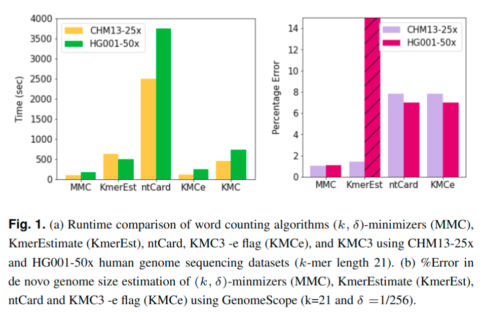

MMC
=
MMC is an open-source program for parallel disk-based counting of (w,k)-minimizers and (k,δ)-minimizers from (possibly gzipped) FASTQ/FASTA files. Given parameters k, and w (default w = k) or δ (default δ = 0.2),  MMC samples minimizers and computes their frequency in a fast and memory efficient manner. Many applications (such as GWAS, de novo genome size estimation, etc.) that require counts of all k-mers in a given sequencing dataset, can be performed using a fraction of time and memory by using only the minimizer statistics. MMC has been built on top of [KMC3](https://github.com/refresh-bio/KMC).


Installation
=
```sh
git clone https://github.com/at-cg/MMC.git
cd MMC
```
After that, you can run ```make``` to compile mmc, mmc_dump, and mmc_tools applications.

**Note:** Some parts of MMC use C++14 features, so you need a compatible C++ compiler, e.g., gcc 4.9+ or clang 3.4+

Binaries
=
After compilation you will obtain the following binaries:
* bin/mmc - the main program for counting minimizer occurrences
* bin/mmc_dump - the program listing minimizers in a database produced by mmc
* bin/mmc_tools - the program allowing to manipulate mmc databases (set operations, transformations, etc.)

Usage
=

```sh
 mmc [options] <input_file_name> <output_file_name> <working_directory>
 mmc [options] <@input_file_names> <output_file_name> <working_directory>
```

### Important Options: 

```sh

  -k<len> - k-mer length (k from 1 to 32; default: 25)

  -ver<version> - '1' for (w,k)-minimizers and '2' for universe-minimizers.

  -d<invdelta> - inverse of k-mer sampling density, i.e., inverse of delta {for universe-minimizers}; default: 5

  -wv<len> - window length {for (w,k)-minimizers}; default: length of k-mer

  -m<size> - max amount of RAM in GB (from 1 to 1024); default: 12

  -p<par> - signature length (5, 6, 7, 8, 9, 10, 11); default: 9

  -f<a/q/m/bam/kmc> - input in FASTA format (-fa), FASTQ format (-fq), multi FASTA (-fm) or BAM (-fbam) or KMC(-fkmc); default: FASTQ

  -ci<value> - exclude minimizers occurring less than <value> times (default: 2)

  -cs<value> - maximal value of a counter (default: 255)

  -cx<value> - exclude minimizers occurring more of than <value> times (default: 1e9)

  -t<value> - total number of threads (default: no. of CPU cores)

```
 
Example
=
To get the counts of (w,k)-minimizers in a dataset:

```sh
mmc -p9 -t16 -k21 -ver1 -wv21 -ci1 -r -cx1000000000 -cs100000000 -hp -fq -m64 input.fastq output <output_directory>
```

To get the counts of (k,δ)-minimizers in a dataset:

```sh
mmc -p9 -t16 -k21 -ver2 -d256 -ci1 -r -cx1000000000 -cs100000000 -hp -fq -m64 input.fastq output <output_directory>
```

To peform genome size estimation from minimizer counts by using [Genomescope](https://github.com/schatzlab/genomescope), we need to transform the counts obtained in a form readable by Genomescope:

```sh
mmc_tools transform output histogram /dev/stdout -ci1 -cx3000000 -cs100000000 | awk ‘{if ($2 >0) print $1, $2}’ > output.histo
```

Finally run Genomscope on the obtained histogram:

```sh
Rscript genomescope.R output.histo <k_size> <read_length> <output_directory>
```
Demo
=

1) Download a sample read set for any organism. For example, download the FASTQ file for Escherichia coli (SRR15334628) <a href="https://trace.ncbi.nlm.nih.gov/Traces/index.html?view=run_browser&acc=SRR15334628&display=download">here</a>.

2) Extract the dataset

3) Use the following commands:

```
mmc -ver2 -d256 -p9 -t1 -k21 -ci1 -cs1000000000 -fq <input_file> output .

mmc_tools transform output histogram output.histo -ci1 -cx3000000 -cs100000000

cat output.histo | awk '{if ($2 >0) print $1, $2}' > final_output.histo
```
4) Upload the final_output.histo file to [Genomescope](http://qb.cshl.edu/genomescope) with the following parameters:
Kmer length = 21, Read length = 250, Max kmer coverage =  3000000

5) Multiply the Genomescope output returned with 1/delta (here delta = 0.00390625, therefore 1/delta = 256) to get the estimated genome size.

Benchmark
=


(k, δ)-MMC, is nearly 4.5× faster and uses 21× lesser memory comapared to KMC3. By using minimizer counts instead of all k-mer counts, downstream applications run significantly faster while maintaining  near-identical output as was shown through the task of Genome size estimation, where (k, δ)-MMC robustly estimated the genome size with just about 1% error using expected density δ =1/256. Even compared to approximate k-mer counters like ntCard, KmerEstimate and KMC3 -e flag, MMC performs better in both speed and accuracy.

License
=
* MMC software distributed under GNU GPL 3 licence.

* libbzip2 is open-source (BSD-style license)

* gzip is free, open-source

* pybind11 (https://github.com/pybind/pybind11) is open-source (BDS-style license)

In case of doubt, please consult the original documentations.


Warranty
=
THE SOFTWARE IS PROVIDED "AS IS", WITHOUT WARRANTY OF ANY KIND, EXPRESS OR IMPLIED,
INCLUDING BUT NOT LIMITED TO THE WARRANTIES OF MERCHANTABILITY, FITNESS FOR A PARTICULAR PURPOSE,
TITLE AND NON-INFRINGEMENT. IN NO EVENT SHALL THE COPYRIGHT HOLDERS OR ANYONE DISTRIBUTING
THE SOFTWARE BE LIABLE FOR ANY DAMAGES OR OTHER LIABILITY, WHETHER IN CONTRACT, TORT OR OTHERWISE,
ARISING FROM, OUT OF OR IN CONNECTION WITH THE SOFTWARE OR THE USE OR OTHER DEALINGS IN THE SOFTWARE.

