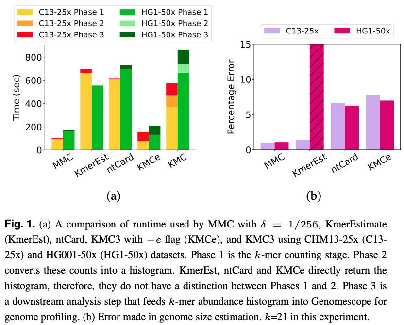

MMC
=
MMC is an open-source program for parallel disk-based counting of minimizers from (possibly gzipped) FASTQ/FASTA files. MMC supports two minimizer techniques from which user can choose one. The first technique, called as [window minimizer](https://doi.org/10.1093/bioinformatics/bth408), provides window guarantee, i.e., there is at least one minimizer sampled in every substring of fixed length. In the second option, called as [universe minimizer](https://doi.org/10.1016/j.cels.2021.08.009), this guarantee is absent. Given parameters k and window length w (for window minimizers), or sampling density δ (for universe minimizers),  MMC samples minimizers and computes their frequency in a fast and memory-efficient manner. Many applications that require counts of k-mers in a raw sequencing dataset (such as [referencef-free GWAS](https://github.com/atifrahman/HAWK), de novo [genome profiling](https://github.com/schatzlab/genomescope), etc.), can be performed much faster in less memory, using only the minimizer count statistics. MMC has been built on top of [KMC3](https://github.com/refresh-bio/KMC).


Installation
=
```sh
git clone https://github.com/at-cg/MMC.git
cd MMC
```
Then run ```make``` to compile mmc, mmc_dump, and mmc_tools applications.

**Note:** Some parts of MMC use C++14 features, so you need a compatible C++ compiler, e.g., gcc 4.9+ or clang 3.4+

Binaries
=
After compilation you will obtain the following binaries:
* bin/mmc - the main program for counting minimizer occurrences
* bin/mmc_dump - the program listing minimizers in a database produced by mmc
* bin/mmc_tools - the program allowing to manipulate mmc databases (set operations, transformations, etc.)

Usage
=

```sh
 mmc [options] <input_file_name> <output_file_name> <working_directory>
 mmc [options] <@input_file_names> <output_file_name> <working_directory>
```

### Important Options: 

```sh

  -k<len> - k-mer length (k from 1 to 32; default: 25)

  -ver<version> - '1' for window minimizers and '2' for universe minimizers.

  -d<invdelta> - inverse of k-mer sampling density, i.e., inverse of delta {for universe minimizers}; default: 5

  -wv<len> - window length {for window minimizers}; default: length of k-mer

  -m<size> - max amount of RAM in GB (from 1 to 1024); default: 12

  -p<par> - signature length (5, 6, 7, 8, 9, 10, 11); default: 9

  -f<a/q/m/bam/kmc> - input in FASTA format (-fa), FASTQ format (-fq), multi FASTA (-fm) or BAM (-fbam) or KMC(-fkmc); default: FASTQ

  -ci<value> - exclude minimizers occurring less than <value> times (default: 2)

  -cs<value> - maximal value of a counter (default: 255)

  -cx<value> - exclude minimizers occurring more of than <value> times (default: 1e9)

  -t<value> - total number of threads (default: no. of CPU cores)

```
 
Example
=
To get the counts of window minimizers in a dataset:

```sh
mmc -p9 -t16 -k21 -ver1 -wv21 -ci1 -r -cx1000000000 -cs100000000 -hp -fq -m64 @input.lst output output_directory
```

To get the counts of universe minimizers in a dataset:

```sh
mmc -p9 -t16 -k21 -ver2 -d256 -ci1 -r -cx1000000000 -cs100000000 -hp -fq -m64 @input.lst output output_directory
```

To peform genome profiling using Genomescope, we need to transform the minimizer counts obtained in a form readable by Genomescope:

```sh
mmc_tools transform input histogram /dev/stdout -ci1 -cx3000000 -cs100000000 | awk ‘{if ($2 >0) print $1, $2}’ > output.histo
```

Finally run Genomscope on the obtained histogram:

```sh
Rscript genomescope.R output.histo k_size read_length output_directory
```
Applications
=
One example of an application where minimizer counts can be useful is [reference-free genome profiling](https://doi.org/10.1093/bioinformatics/btx153). Genome profiling is routinely used as a preprocessing step of genome assembly, where the k-mer frequencies in raw sequencing reads are used to statistically estimate genome size, heterozygosity, and repeat content.

1) Download a sample read set for any organism. For example, download the FASTQ file for Escherichia coli (SRR15334628) <a href="https://trace.ncbi.nlm.nih.gov/Traces/index.html?view=run_browser&acc=SRR15334628&display=download">here</a>.

2) Extract the dataset

3) Use the following commands:

```
mmc -ver2 -d256 -p9 -t1 -k21 -ci1 -cs1000000000 -fq <input_file> output .

mmc_tools transform output histogram output.histo -ci1 -cx3000000 -cs100000000

cat output.histo | awk '{if ($2 >0) print $1, $2}' > final_output.histo
```
4) Upload the final_output.histo file to <a href="http://qb.cshl.edu/genomescope/">Genomescope</a> with the following parameters:
Kmer length = 21, Read length = 250, Max kmer coverage =  3000000

5) Multiply the Genomescope's estimated genome size with inverse of density δ (which is 256 here) to get the final estimated genome size.

Benchmark
=


Counting universe minimizers in MMC, is nearly 5× faster and uses 22× lesser memory compared to KMC3. By using minimizer counts instead of all k-mer counts, downstream applications run significantly faster while maintaining  near-identical output as was shown through the task of de novo estimation of genome statistics, where universe minimizers estimated the genome size with just about 1% error using expected density δ =1/256. Even compared to approximate k-mer counters like ntCard, KmerEstimate and KMC3 -e flag, MMC performs better in both speed and accuracy.

License
=
* MMC software distributed under GNU GPL 3 licence.

* libbzip2 is open-source (BSD-style license)

* gzip is free, open-source

* pybind11 (https://github.com/pybind/pybind11) is open-source (BDS-style license)

In case of doubt, please consult the original documentations.


Warranty
=
THE SOFTWARE IS PROVIDED "AS IS", WITHOUT WARRANTY OF ANY KIND, EXPRESS OR IMPLIED,
INCLUDING BUT NOT LIMITED TO THE WARRANTIES OF MERCHANTABILITY, FITNESS FOR A PARTICULAR PURPOSE,
TITLE AND NON-INFRINGEMENT. IN NO EVENT SHALL THE COPYRIGHT HOLDERS OR ANYONE DISTRIBUTING
THE SOFTWARE BE LIABLE FOR ANY DAMAGES OR OTHER LIABILITY, WHETHER IN CONTRACT, TORT OR OTHERWISE,
ARISING FROM, OUT OF OR IN CONNECTION WITH THE SOFTWARE OR THE USE OR OTHER DEALINGS IN THE SOFTWARE.

